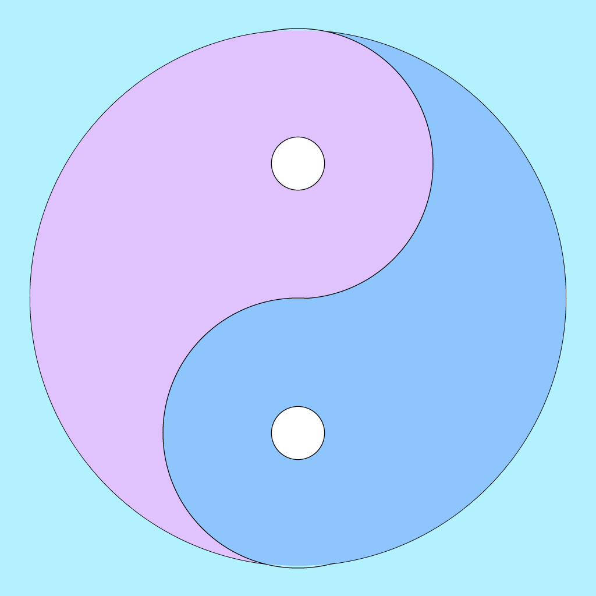
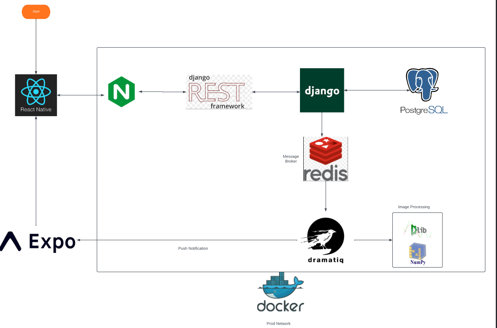

# MyMorph

MyMorph is a react-native iOS app that lets you morph two faces together using a [Morph API](https://github.com/osamja/ImageMorpher).

<!-- Link to mymorph-iOS/assets/adaptive-icon.png -->


## Table of Contents

- [Features](#features)
- [Installation](#installation)
- [Usage](#usage)
- [Development](#development)
- [License](#license)

## Architecture
 

## Features

- Upload two images of faces
- Morph the faces together into a single image or a GIF
- View the morphed result
- Restart the process with new images

## Installation

To install and run the app locally, you'll need to have Node.js and npm installed on your machine.

1. Clone the repository: 

```
git clone https://github.com/yourusername/MyMorph.git
```

2. Install dependencies: 
```
cd MyMorph
npm install
```

3. Start the development server:
```
npx expo start --tunnel
```

For web, you may have to use the IP address instead of localhost. i.e. http://172.19.177.199:19006


### [Building the iOS App](https://github.com/osamja/imagemorpher-mobile/issues/25)

To build/deploy for web, run `expo build:web` then `cd web-build; vercel--prod`


## Usage

1. Upload the first image of a face using the ImageUploadButton component.
2. Upload the second image of a face using the ImageUploadButton component.
3. Choose whether you want to create an image or a GIF using the Button components.
4. Press the MorphButton component to morph the faces together.
5. View the morphed result using the MorphResponseView component.
6. Restart the process with new images using the Restart button.

## License

This project is licensed under the MIT License. See the [LICENSE](LICENSE) file for details.

=======
# Development
* Run `npx expo start --tunnel`
* For web, we may have to use the IP address instead of localhost. i.e. `http://172.19.177.199:19006`
