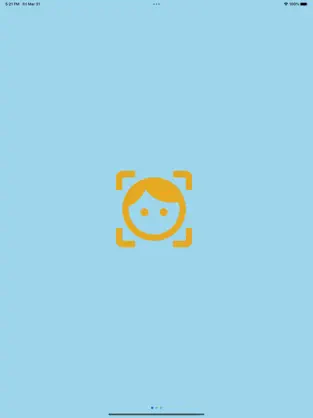

# MyMorph

MyMorph is a mobile application that allows users to morph two faces together using our Morph API. The application is built using React Native and ExpressJS, and is published on the App Store. You can download the app [here](https://apps.apple.com/us/app/mymorph/id1554421298).



## Table of Contents

- [Features](#features)
- [Installation](#installation)
- [Usage](#usage)
- [Development](#development)
- [License](#license)

## Features

- Upload two images of faces
- Morph the faces together into a single image or a GIF
- View the morphed result
- Restart the process with new images

## Installation

To install and run the app locally, you'll need to have Node.js and npm installed on your machine.

1. Clone the repository: 

```
git clone https://github.com/yourusername/MyMorph.git
```

2. Install dependencies: 
```
cd MyMorph
npm install
```

3. Start the development server:
```
npx expo start --tunnel
```

For web, you may have to use the IP address instead of localhost. i.e. http://172.19.177.199:19006

## Usage

1. Upload the first image of a face using the ImageUploadButton component.
2. Upload the second image of a face using the ImageUploadButton component.
3. Choose whether you want to create an image or a GIF using the Button components.
4. Press the MorphButton component to morph the faces together.
5. View the morphed result using the MorphResponseView component.
6. Restart the process with new images using the Restart button.

## Todo
- [ ] Rewrite the backend API to be async.  Currently, the backend API is synchronous.  This is causing the UI to stay in the loading state when the user clicks the morph button and then minimizes the app because it terminates the network request that was in progress.  Apple terminates any network requests from apps once they are minimized for good reason.  We could add a background fetch call but it's ultimately just a hack.  We need to make the backend API async so that user can click the morph button and then minimize the app.  The backend API should then continue to run in the background and send a notification to the user when the morph is complete.  The user can then click the notification to open the app and view the morphed image.  Once this is done, the isSequence flag should be set to true in the morph request and the user should be able to click the morph button again to generate the morph sequence.


## License

This project is licensed under the MIT License. See the [LICENSE](LICENSE) file for details.


